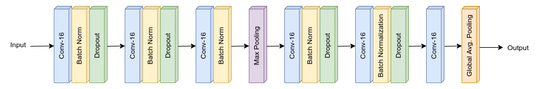

# Session 4 - Architectural Basics (MNIST Classification)

The goal of this assignment is to reach an accuracy of **99.4%** on the _MNIST test dataset_ with a model having following configurations:

- Less than 20,000 parameters
- The desired accuracy should be achieved in less than 20 epochs.

## Model Architecture

### Parameters and Hyperparameters

- Kernel Size: 3x3
- Loss Function: Negative Log Likelihood
- Optimizer: SGD
- Dropout Rate: 0.15
- Batch Size: 32
- Learning Rate: 0.01
- Epochs: 10

The model reached the test accuracy of **99.45%** after **10 epochs**. After 19 epochs, the test accuracy was 99.49%

## Project Setup

### On Local System

Install the required packages  
 `$ pip install -r requirements.txt`

### On Google Colab

Select Python 3 as the runtime type and GPU as the harware accelerator.

## Group Members

- Shantanu Acharya (Canvas ID: 25180630)
- Rakhee (Canvas ID: 25180625)
- Vedapragna Aramati (Canvas ID: 25180631)
