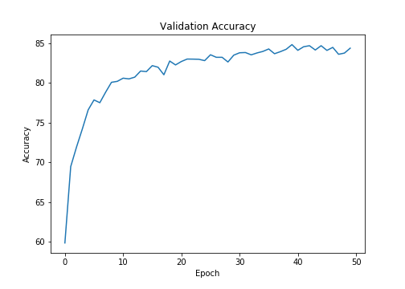

# Session 7 - Advanced Convolutions

The model reaches a test accuracy of **84.83%** in **CIFAR-10** dataset. The model uses the following types of convolutions:

- 3x3 Convolution
- Pointwise Convolution
- Atrous Convolution
- Depthwise Separable Convolution
- Max Pooling

The model has **94,218 parameters**.

## Model Architecture

### Parameters and Hyperparameters

- Loss Function: Cross Entropy Loss
- Optimizer: SGD
- Learning Rate: 0.01
- Dropout Rate: 0.1
- Batch Size: 64
- Epochs: 50

## Change in Validation Loss and Accuracy

## Project Setup

### On Local System

Install the required packages  
 `$ pip install -r requirements.txt`

### On Google Colab

Upload the files in the root folder and select Python 3 as the runtime type and GPU as the harware accelerator.

## Group Members

- Rakhee (Canvas ID: 25180625)
- Shantanu Acharya (Canvas ID: 25180630)
