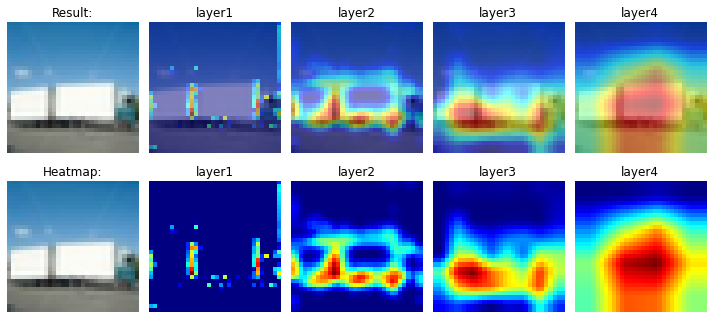
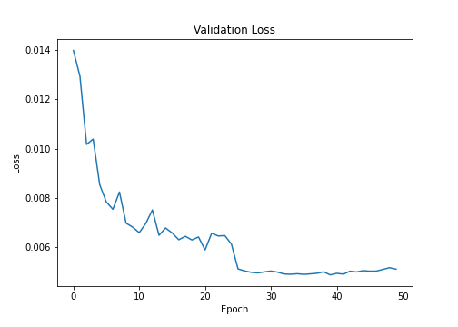
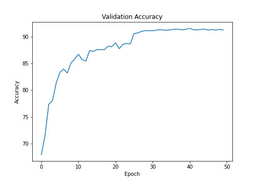

# Session 9 - Data Augmentation and Grad Cam

The model reaches a maximum accuracy of **91.53%** in **41 epochs** on CIFAR-10 dataset using **ResNet-18** model.

**Gradient-weighted Class Activation Map (GradCAM)** was implemented for each convolution block to generate model prediction heatmaps (Examples shown below).

### Parameters and Hyperparameters

- Loss Function: Cross Entropy Loss (combination of `nn.LogSoftmax` and `nn.NLLLoss`)
- Optimizer: SGD
- Learning Rate: 0.01
- LR Step Size: 25
- LR Gamma: 0.1
- Batch Size: 64
- Epochs: 50

### Data Augmentation

The following data augmentation techniques were applied to the dataset during training:

- Horizontal Flip
- Rotation
- CutOut

The `albumentations` package was used to apply augmentation.

## GradCAM

Some of the examples where the network was focusing while predicting the output is shown below:

### Image 1

### Image 2

### Image 3

### Image 4

## Change in Validation Loss and Accuracy

## Correctly Classified Images

## Misclassified Images

## Project Setup

### On Local System

Install the required packages  
 `$ pip install -r requirements.txt`

### On Google Colab

Upload the files in the root folder and select Python 3 as the runtime type and GPU as the harware accelerator.

## Group Members

- Shantanu Acharya (Canvas ID: 25180630)
- Rakhee (Canvas ID: 25180625)
