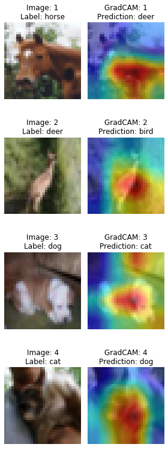
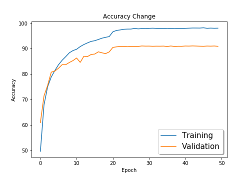

# Session 10 - Learning Rates

The model reaches a maximum accuracy of **91.11%** on CIFAR-10 dataset using **ResNet-18** model.

**LR Finder and Reduce LR on Plateau** was implemented for model training.

The model uses the library **TensorNet** to train the model. The library can be installed by running the following command  
`pip install torch-tensornet==0.0.7`  
The source code for the library can be found [here](https://github.com/shan18/TensorNet).

### Parameters and Hyperparameters

- Loss Function: Cross Entropy Loss (combination of `nn.LogSoftmax` and `nn.NLLLoss`)
- LR Finder
  - Start LR: 1e-7
  - End LR: 5
  - Number of iterations: 400
- Optimizer: SGD
  - Momentum: 0.9
  - Learning Rate: 0.012 (Obtained from LR Finder)
- Reduce LR on Plateau
  - Decay factor: 0.1
  - Patience: 2
  - Min LR: 1e-4
- Batch Size: 64
- Epochs: 50

### Data Augmentation

The following data augmentation techniques were applied to the dataset during training:

- Horizontal Flip
- Rotation
- CutOut

## GradCAM

Some of the examples of GradCAM on misclassified images is shown below:

## Change in Training and Validation Accuracy

## Project Setup

### On Local System

Install the required packages  
 `$ pip install -r requirements.txt`

### On Google Colab

Upload the files in the root folder and select Python 3 as the runtime type and GPU as the harware accelerator.

## Group Members

- Shantanu Acharya (Canvas ID: 25180630)
- Rakhee (Canvas ID: 25180625)
