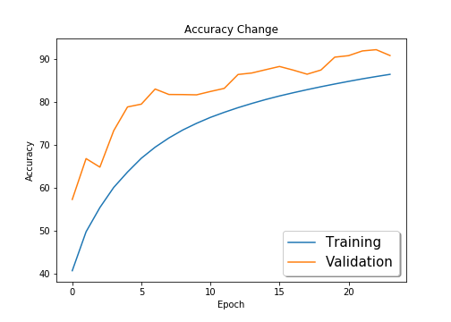
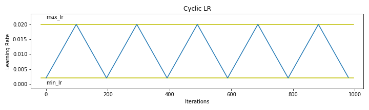

# Session 11 - Super Convergence

The model reaches a maximum accuracy of **92.26%** on CIFAR-10 using **One Cycle Policy for Learning Rate**.

### Parameters and Hyperparameters

- Loss Function: Cross Entropy Loss (combination of `nn.LogSoftmax` and `nn.NLLLoss`)
- Optimizer: SGD
  - Momentum: 0.9
  - L2 regularization factor: 0.01
- LR Range Test
  - Start LR: 1e-6
  - End LR: 0.02
  - Number of epochs: 10
  - Comparison Metric: Accuracy
- One Cycle Policy
  - Max LR: 0.02
  - Min LR: 0.002
  - Increase LR step size: 5 epochs
- Epochs: 24
- Batch Size: 512

### Data Augmentation

The following data augmentation techniques were applied to the dataset during training:

- Padding
- Random Crop
- Flip LR
- CutOut

## Change in Training and Validation Accuracy

## Cyclic LR Triangular Schedule

## Project Setup

### On Local System

Install the required packages  
 `$ pip install -r requirements.txt`

### On Google Colab

Upload the files in the root folder and select Python 3 as the runtime type and GPU as the harware accelerator.

## Group Members

- Rakhee (Canvas ID: 25180625)
- Shantanu Acharya (Canvas ID: 25180630)
