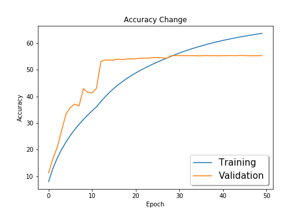
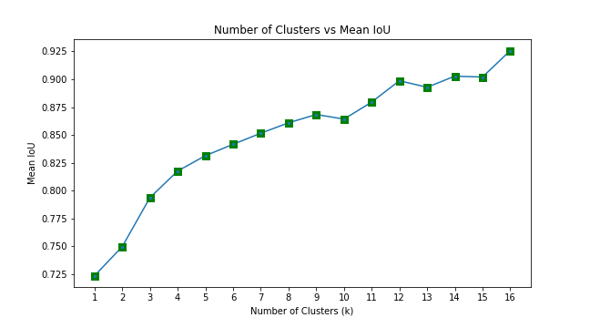
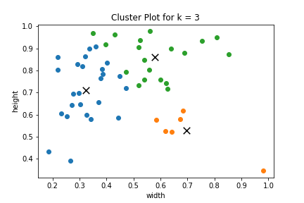
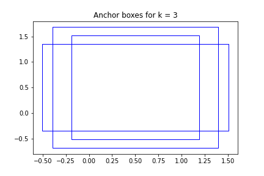
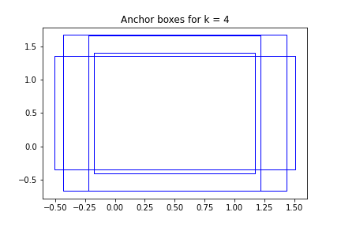

# Session 12 - Tiny ImageNet and YOLO v2 Anchor Boxes

## Part 1 - ResNet18 on Tiny ImageNet Dataset

The model reaches a maximum accuracy of **55.42%** on Tiny-ImageNet using **ResNet 18** model.

### Parameters and Hyperparameters

- Loss Function: Cross Entropy Loss (combination of `nn.LogSoftmax` and `nn.NLLLoss`)
- Optimizer: SGD
  - Momentum: 0.9
  - Learning Rate: 0.01
- Reduce LR on Plateau
  - Patience: 2
  - Factor: 0.1
  - Min LR: 1e-6
- Epochs: 50
- Batch Size: 128

### Data Augmentation

The following data augmentation techniques were applied to the dataset during training:

- Horizontal Flip
- Vertical Flip
- Random Rotate
- CutOut

### Change in Training and Validation Accuracy

## Part 2 - Finding YOLO v2 Anchor Boxes

Finding anchor boxes on a [dataset of 50 dogs](images/dogs) using **K-Means Clustering ALgorithm**. The dataset was annotated and exported in _COCO JSON Format_. It can be found [here](dogs.json).

### Plot of Number of clusters vs Mean IoU

After running the algorithm on the dataset, it was found that the best k can have the value of 3 or 4.

| Number of Clusters (k) | Mean IoU |                  Cluster Plot                  |                 Anchor Boxes                 |
| :--------------------: | :------: | :--------------------------------------------: | :------------------------------------------: |
|           3            |   0.75   |  |  |
|           4            |   0.79   |  |  |

## Project Setup

### On Local System

Install the required packages  
 `$ pip install -r requirements.txt`

### On Google Colab

Upload the directory `tensornet` and the file `dogs.json` in the root folder and select Python 3 as the runtime type and GPU as the harware accelerator.

## Group Members

- Shantanu Acharya (Canvas ID: 25180630)
- Rakhee (Canvas ID: 25180625)
