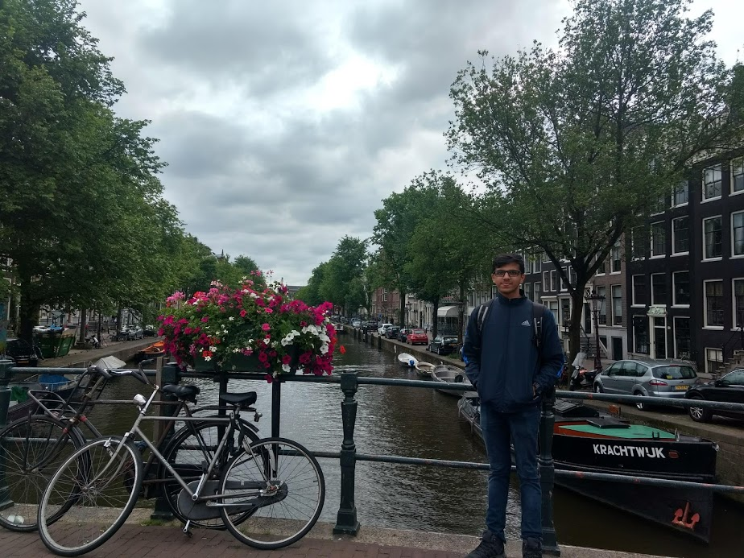
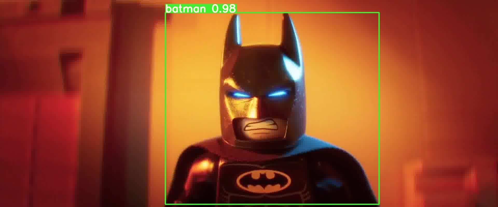
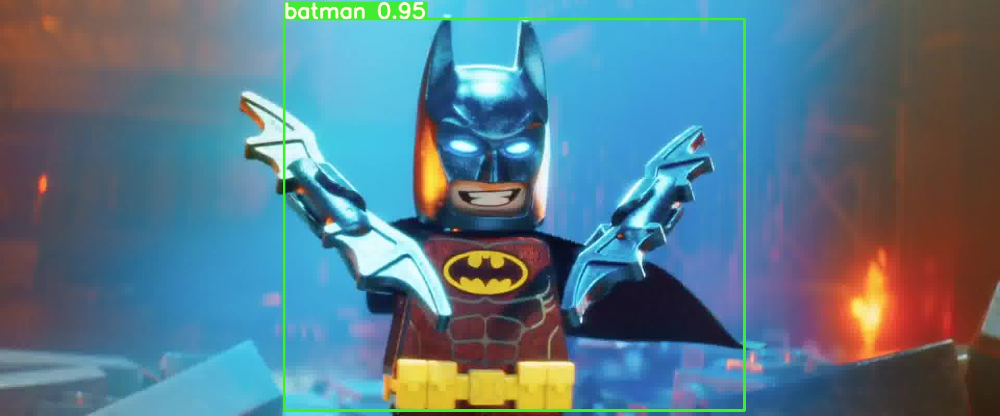
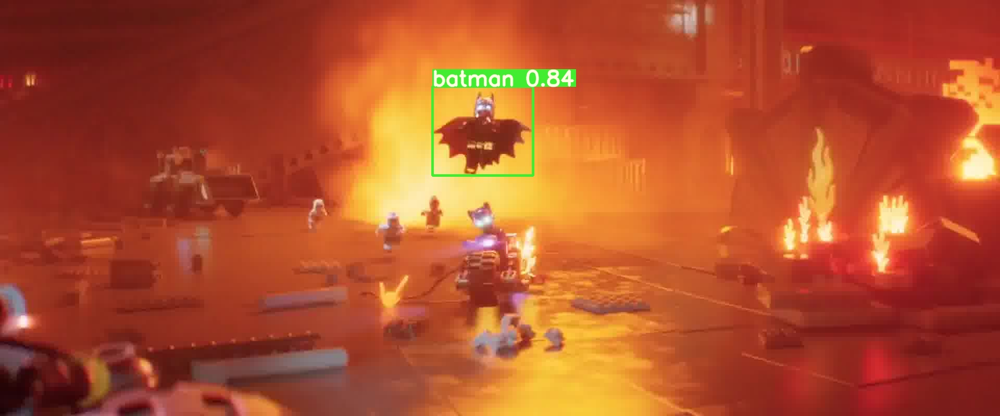
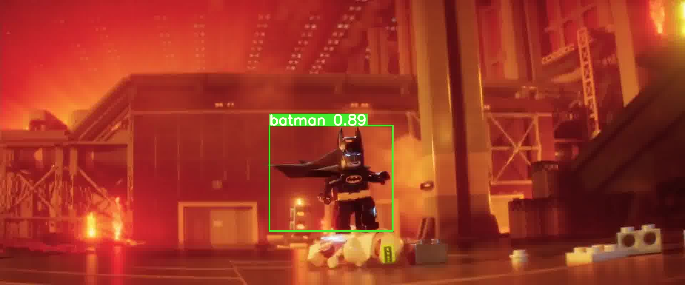

# Session 13 - Object Detection with YOLO v3

## Part 1 - YOLO v3 with OpenCV

Detecting objects in an image where there is a person and an object present in the image.  
_Note_: The object should be present in the COCO classes.

### Result

  

## Part 2 - YOLO v3 with PyTorch

Object detection with Yolo v3 using transfer learning on a class that doesn't belong to COCO dataset.

Class selected: **LEGO Batman**

### Result

Click on the video below to play  

### Parameters and Hyperparameters

- Number of images: 500
- Batch size: 10
- Epochs: 300

### Dataset Preparation

For using the LEGO Batman dataset, follow the instructions mentioned [here](YoloV3/data/README.md). To run the model on custom dataset, follow the steps below

#### Train Data

- Annotating the images
  - Clone the annotation tool from this [link](https://github.com/miki998/YoloV3_Annotation_Tool).
  - Follow the steps mentioned in the README of the tool specified above.
  - Annotate atleast 500 images with the tool.
- Creating dataset directory
  - Place the annotated images [here](YoloV3/data/train/images).
  - Place the labels [here](YoloV3/data/train/labels).

#### Test Data

- Download a short-duration video containing the class used during training.
- Extract frames from the video into the [test](YoloV3/data/test) directory  
  `ffmpeg -i video.mp4 data/test/img%3d.jpg`
- Extract audio from the video (this audio will be required later)  
  `ffmpeg -i video.mp4 -f mp3 -ab 192000 -vn audio.mp3`

### Downloading Pre-Trained Weights

Download the file named `yolov3-spp-ultralytics.pt` from this [link](https://drive.google.com/open?id=1LezFG5g3BCW6iYaV89B2i64cqEUZD7e0) and place it in [this](YoloV3/weights) directory.

### Inference on a Video

- Combine the images from the [output](YoloV3/output) directory to form a video  
  `ffmpeg -framerate 24 -i YoloV3/output/img%3d.jpg -r 24 -y out_video.mp4`
- Combine the audio file extracted earlier with the output video to produce final output  
  `ffmpeg -i out_video.mp4 -i audio.mp3 -shortest result.mp4`

### Results

After running the algorithm for 300 epochs, the result is pretty amazing!

  
  
  
  

## Group Members

- Rakhee (Canvas ID: 25180625)
- Shantanu Acharya (Canvas ID: 25180630)
