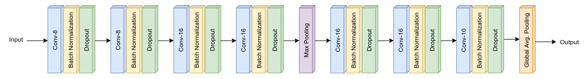

# Session 5 - MNIST 99.4% Test Accuracy with less than 10,000 Parameters

The goal of this assignment is to reach a test accuracy of **99.4%** on the _MNIST test dataset_ with a model having following configurations:

- Less than 10,000 parameters
- The desired accuracy should be achieved in 15 epochs

The desired target should be achieved in a minimum of 5 steps.

### Step 1

#### Target

- Get the set-up right
- Visualize dataset statistics and samples
- Set the data transforms
- Set train and test data and create the data loader
- Create an initial working model architecture
- Set training and test loop

#### Result

- Parameters: 15,530
- Best Training Accuracy: 99.12
- Best Test Accuracy: 98.98

#### Analysis

- Number of model parameters is more than the required number
- Training and Test accuracy is less
- Model is overfitting

### Step 2

#### Target

- Decrease the number of model parameters

  - Reduce the number of kernels
  - Use 1x1 kernel before GAP
  - Add Global Average Pooling (GAP)

- Decrease Batch Size  
  Small batch size helps the model to escape any local minima

#### Result

- Parameters: 8,962
- Best Training Accuracy: 98.92
- Best Test Accuracy: 98.94

#### Analysis

- Light Model
- Model is training well, the accuracy is increasing steadily with extremely less fluctuations
- Model is still capable of getting better accuracy if pushed further

### Step 3

#### Target

- Apply Batch Normalization to increase model accuracy

#### Result

- Parameters: 9,142
- Best Training Accuracy: 99.38
- Best Test Accuracy: 99.35

#### Analysis

- Good Model, very close to the target accuracy
- The model is not very robust as the test accuracy keeps on fluctuating

### Step 4

#### Target

- Apply LR Scheduler  
  In last attempt, the model accuracy was decreasing after 5th epoch so LR step is set to 5.

#### Result

- Parameters: 9,142
- Best Training Accuracy: 99.41
- Best Test Accuracy: 99.45

#### Analysis

- Great Model! Model crossed the target accuracy
- Even after applying LR scheduler, the model accuracy is still not showing the desired level of steadiness. The test accuracy drops soon after crossing 99.4%
- The model is still capable of being pushed further

### Step 5

#### Target

- Apply Dropout
- Add Image Augmentation

#### Result

- Parameters: 9,142
- Best Training Accuracy: 99.11
- Best Test Accuracy: 99.46

#### Analysis

- Great Model!
- Dropout and Image Augmentation have made the model robust
- Now we see some decent steadiness in the test accuracy. Model fluctuation has decreased.

## Model Architecture

### Parameters and Hyperparameters

- Kernel Size: 3x3
- Loss Function: Negative Log Likelihood
- Optimizer: SGD
- Dropout Rate: 0.01
- Batch Size: 64
- Learning Rate: 0.01

The model reached the test accuracy of **99.46%** after **10 epochs**.

## Project Setup

### On Local System

Install the required packages  
 `$ pip install -r requirements.txt`

### On Google Colab

Select Python 3 as the runtime type and GPU as the harware accelerator.

## Group Members

- Shantanu Acharya (Canvas ID: 25180630)
- Rakhee (Canvas ID: 25180625)
