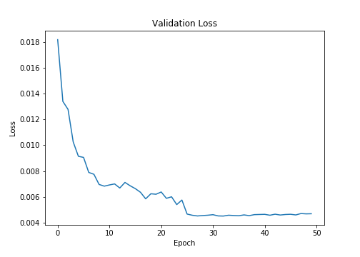
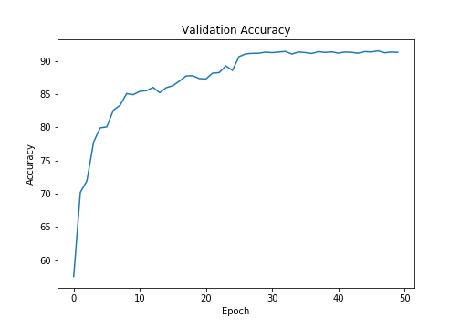
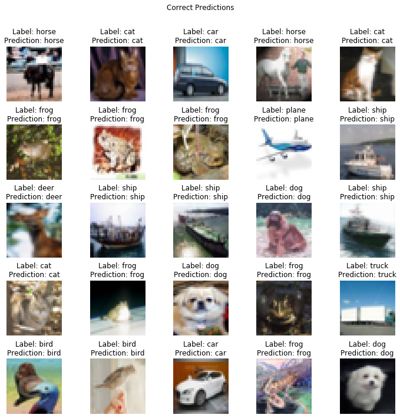
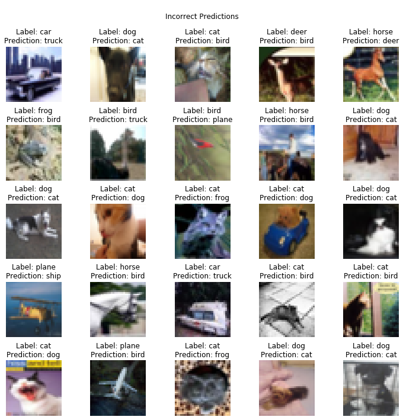

# Session 8 - Receptive Fields and Network Architecture

The model reaches a maximum accuracy of **91.51%** in **47 epochs** on CIFAR-10 dataset using **ResNet-18** model.

### Parameters and Hyperparameters

- Loss Function: Cross Entropy Loss (combination of `nn.LogSoftmax` and `nn.NLLLoss`)
- Optimizer: SGD
- Learning Rate: 0.01
- LR Step Size: 25
- LR Gamma: 0.1
- Batch Size: 64
- Epochs: 50

### Data Augmentation

The following data augmentation techniques were applied to the dataset during training:

- Random Horizontal Flip: 0.2
- Random Vertical Flip: 0.1
- Random Rotation: 10 degrees
- Random Erasing: 0.3

The `transforms` library in the package `torchvision` was used to apply augmentation.

## Change in Validation Loss and Accuracy

## Correctly Classified Images

## Misclassified Images

## Project Setup

### On Local System

Install the required packages  
 `$ pip install -r requirements.txt`

### On Google Colab

Upload the files in the root folder and select Python 3 as the runtime type and GPU as the harware accelerator.

## Group Members

- Shantanu Acharya (Canvas ID: 25180630)
- Rakhee (Canvas ID: 25180625)
