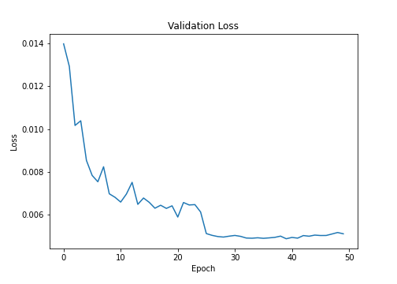
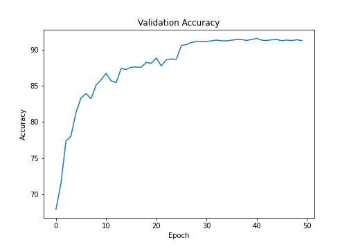
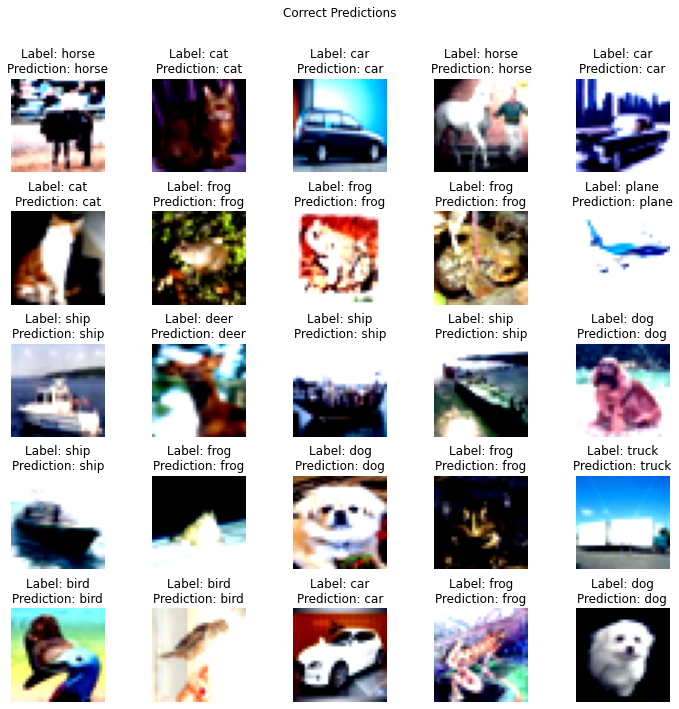
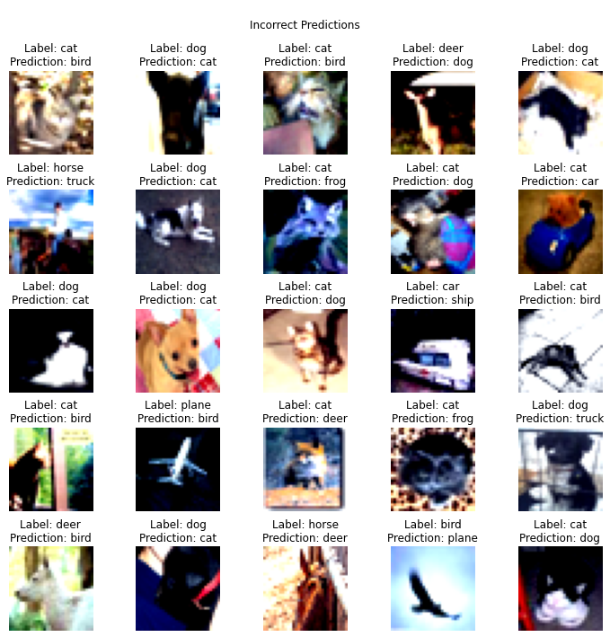

# Session 9 - Data Augmentation and Grad Cam

The model reaches a maximum accuracy of **--%** in **-- epochs** on CIFAR-10 dataset using **ResNet-18** model.

### Parameters and Hyperparameters

- Loss Function: Cross Entropy Loss (combination of `nn.LogSoftmax` and `nn.NLLLoss`)
- Optimizer: SGD

### Data Augmentation

## Change in Validation Loss and Accuracy

<!-- 
 -->

## Correctly Classified Images

<!--  -->

## Misclassified Images

<!--  -->

## Project Setup

### On Local System

Install the required packages  
 `$ pip install -r requirements.txt`

### On Google Colab

Upload the files in the root folder and select Python 3 as the runtime type and GPU as the harware accelerator.

## Group Members

- Shantanu Acharya (Canvas ID: 25180630)
- Rakhee (Canvas ID: 25180625)
